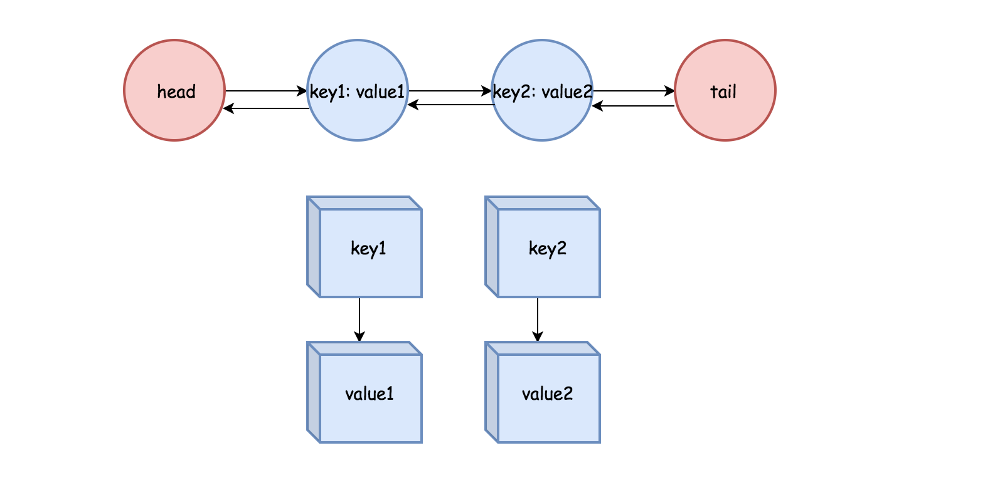

# [Medium][146. LRU Cache](https://leetcode.com/problems/lru-cache/)

Design and implement a data structure for [Least Recently Used (LRU)](https://en.wikipedia.org/wiki/Cache_replacement_policies#LRU) cache. It should support the following operations: get and put.

get(key) - Get the value (will always be positive) of the key if the key exists in the cache, otherwise return -1.
put(key, value) - Set or insert the value if the key is not already present. When the cache reached its capacity, it should invalidate the least recently used item before inserting a new item.

The cache is initialized with a positive capacity.

Follow up:
Could you do both operations in O(1) time complexity?

**Example:**

```text
LRUCache cache = new LRUCache( 2 /* capacity */ );

cache.put(1, 1);
cache.put(2, 2);
cache.get(1);       // returns 1
cache.put(3, 3);    // evicts key 2
cache.get(2);       // returns -1 (not found)
cache.put(4, 4);    // evicts key 1
cache.get(1);       // returns -1 (not found)
cache.get(3);       // returns 3
cache.get(4);       // returns 4
```

## 思路 - `Dictionary + List<T>`

题目要求实现 LRU 缓存机制，需要在 O(1) 时间内完成如下操作：

* 获取键 / 检查键是否存在
* 设置键
* 删除最先插入的键

既然要求是O(1)，第一个就会想到HashTable或者Dictionary. 既然又要求LRU，那么要使用`List<int>`来更新最近的使用状态。
新增的item放在List的头部，最近访问的item也会移动到头部。删除从尾部开始。

## 代码 - `Dictionary + LinkList`

```csharp
public class LRUCache
{
    private Dictionary<int, int> cache;
    private List<int> lookup;
    public int Count
    {
        get { return this.cache.Count; }
    }

    private int capacity = 0;

    public LRUCache(int capacity)
    {
        cache = new Dictionary<int, int>(capacity);
        this.capacity = capacity;
        this.lookup = new List<int>(capacity);
    }

    public int Get(int key)
    {
        if (cache.ContainsKey(key))
        {
            Refresh(key);
            return cache[key];
        }
        else return -1;
    }

    public void Put(int key, int value)
    {

        if (cache.ContainsKey(key))
        {
            cache[key] = value;
            Refresh(key);
        }
        else
        {
            if (this.Count >= this.capacity)
                Flush();
            cache.Add(key, value);
            lookup.Insert(0, key);
        }
    }

    private void Flush()
    {
        int key = lookup[lookup.Count - 1];
        lookup.Remove(key);
        cache.Remove(key);
    }

    private void Refresh(int key)
    {
        lookup.Remove(key);
        lookup.Insert(0, key);
    }

}

/**
 * Your LRUCache object will be instantiated and called as such:
 * LRUCache obj = new LRUCache(capacity);
 * int param_1 = obj.Get(key);
 * obj.Put(key,value);
 */
```

## 思路 - Dictionary + 双向链表

如果不是用`List<T>`, 也可以用一个双向链表来替代它的功能。



1. Dictionary保存的是key，以及双向链表中每个节点对象。而key和value则保存在这个节点中。
2. 插入一个新的对象到LRUCache中的时候, 将创建一个新的DoubleLinkedList对象。将这个对象插入到双向链表的头部。将key和这个对象的引用保存在Dictionary中。
3. 从cache中更新或者读取对象的时候，可以从Dictionary中通过key找到DoubleLinkedList的对象，时间复杂度为O(1).然后再将DoubleLinkedList对象切换到双向链表的头部。在链表中移动元素的时间复杂度为O(1). 之所以使用双向链表而非单项链表的原因，就是因为双向链表中移除一个项元素的时候，可以通过当前的这个元素的pre和next分别获得它的上一个和下一个元素，将他们链接到一起，完成移除的动作。
4. 当cahce满的时候，将链表的尾部的元素移除。同时，从Dictionary中将对应的记录移除。要在双向链表中找到尾部的元素，并且时间复杂度为O(1), 所有设置了双向链表的尾部节点tail. 为了能够以O(1)的时间复杂度从Dictionary中移除一个记录， DoubleLinkedList的对象除了记录value以外，还记录了key.

总之在 LRUCache 中总是把最近更新过的 CacheEntryNode 放到链表头部，并将 head 指向它。则 tail 指向的为链表尾部节点，它为最不活跃节点。整个链表是按时间顺序排列的，当发现 Capacity 不足时就清除链表尾部节点。

## 代码 - 链表

```csharp
public class LRUCache
{
    private Dictionary<int, DoubleLinkedList> cache;
    private DoubleLinkedList head;
    private DoubleLinkedList tail;
    public int Count
    {
        get { return this.cache.Count; }
    }

    private int capacity = 0;

    public LRUCache(int capacity)
    {
        cache = new Dictionary<int, DoubleLinkedList>(capacity);
        this.capacity = capacity;
        this.head = new DoubleLinkedList();
        this.tail = new DoubleLinkedList();
        head.next = tail;
        tail.pre = head;
    }

    public int Get(int key)
    {
        if (cache.ContainsKey(key))
        {
            Refresh(cache[key]);
            return cache[key].val;
        }
        else return -1;
    }

    public void Put(int key, int value)
    {

        if (cache.ContainsKey(key))
        {
            cache[key].val = value;
            Refresh(cache[key]);
        }
        else
        {
            if (this.Count >= this.capacity) Flush();
            // init DoubleLinkedList
            DoubleLinkedList cur = new DoubleLinkedList();
            cur.val = value;
            cur.key = key;
            // add to link
            AttachToHead(cur);
            // add to cache
            cache.Add(key, cur);
        }
    }

    private void Flush()
    {
        int key = tail.pre.key;
        cache.Remove(key);
        tail.pre = tail.pre.pre;
        tail.pre.next = tail;
    }

    private void Refresh(DoubleLinkedList item)
    {
        DoubleLinkedList pre = item.pre;
        DoubleLinkedList next = item.next;
        pre.next = next;
        next.pre = pre;
        AttachToHead(item);
    }

    private void AttachToHead(DoubleLinkedList item)
    {
        DoubleLinkedList tmp = head.next;
        head.next = item;
        item.pre = head;
        item.next = tmp;
        tmp.pre = item;
    }
}

public class DoubleLinkedList
{
    public DoubleLinkedList pre;
    public DoubleLinkedList next;
    public int key;
    public int val;
}

/**
 * Your LRUCache object will be instantiated and called as such:
 * LRUCache obj = new LRUCache(capacity);
 * int param_1 = obj.Get(key);
 * obj.Put(key,value);
 */
```
